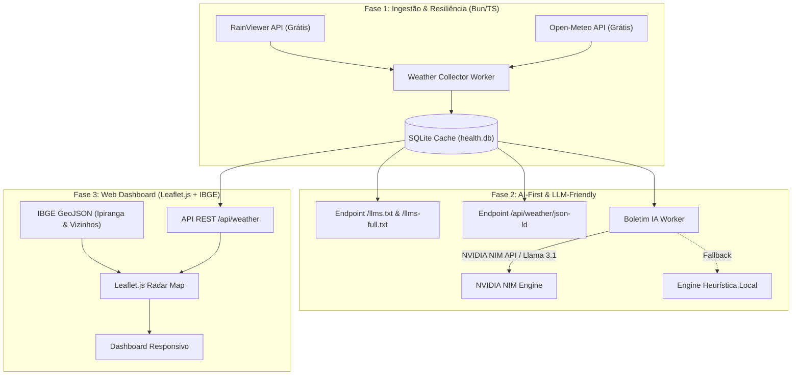

# Monitor Ipiranga & Radar Climatológico AI-First

Monitor unificado de serviços e clima para **Ipiranga e Região dos Campos Gerais — PR**. Projeto utilitário, comunitário, sem fins lucrativos, focado na arquitetura **Zero-Cost** e **LLM-Friendly / AI-First**.



## 🌦️ Funcionalidades Meteorológicas & Clima
- **Radar RainViewer 10min**: Animação contínua de mancha de chuva dos últimos 60 minutos e nowcast.
- **Nowcast Determinístico (Camada A)**: Análise por visão computacional dos tiles do radar — classifica pixels pela paleta oficial Universal Blue (dBZ→cor), agrupa núcleos por intensidade e rastreia movimento/direção/velocidade entre frames (`/api/weather/nowcast`).
- **Camada Vetorial IBGE**: Limites municipais exatos de Ipiranga (`4110508`) com realce neon e municípios vizinhos (Ponta Grossa, Castro, Prudentópolis, Tibagi, Imbituva, Teixeira Soares, Guamiranga, Ivaí).
- **Endpoint `/llms.txt`**: Exposição em Markdown denso para assistentes de IA (ChatGPT, Claude, modelos locais).
- **Botões "Pergunte ao ChatGPT/Claude/Gemini"**: Ação direta no site que abre o chat com prompt montado (lê o `/llms.txt` e resume clima + serviços).
- **JSON-LD Schema**: Dados estritamente estruturados (`https://schema.org/SpecialAnnouncement`).
- **Boletins IA (NVIDIA NIM)**: Síntese em linguagem natural gerada por modelos da NVIDIA NIM (`meta/llama-3.1-8b-instruct`) ou engine de regras heurísticas locais.

## 📡 Monitoramento de Infraestrutura Pública
- **Operadoras móveis**: Claro, Vivo, TIM (portais, conectividade, BGP)
- **COPEL**: Ocorrências de energia (programadas e emergenciais)
- **Sanepar**: Interrupções programadas de abastecimento de água

---

## 🛠️ Stack

- **Runtime:** Bun 1.3+ (local) / Node.js 20+ (Vercel serverless)
- **Linguagem:** TypeScript
- **Banco:** Turso Cloud SQLite (`@libsql/client/web`, sem binários nativos) com fallback em memória
- **Mapas & UI:** Leaflet.js + CartoDB / OpenStreetMap + IBGE GeoJSON
- **LLM Engine:** NVIDIA NIM API (Llama 3.1 / Llama 3.2 Vision) / Gemini API / Local Heuristic Engine
- **Visão Computacional:** `pngjs` (decodificação de tiles PNG, puro JS — roda na Vercel)
- **HTTP:** Servidor nativo Bun (local) / funções serverless Vercel (`api/`)
- **Logs:** JSON estruturado

---

## ⚙️ Configuração

Copie `.env.example` para `.env` e preencha:

| Variável | Descrição | Default |
|---|---|---|
| `TURSO_DATABASE_URL` | URL do banco Turso Cloud (ex: `libsql://...turso.io`) | fallback em memória |
| `TURSO_AUTH_TOKEN` | Token de autenticação do Turso | — |
| `NVIDIA_NIM_API_KEY` | Chave de API da NVIDIA NIM (boletins IA + nowcast VLM) | — |
| `GEMINI_API_KEY` | Chave da API Gemini (fallback de boletim IA) | — |
| `TELEGRAM_BOT_TOKEN` | Token do bot Telegram | — |
| `TELEGRAM_CHAT_ID` | Chat ID para alertas | — |
| `CHECK_INTERVAL_MS` | Intervalo entre ciclos (ms) | `60000` |
| `HTTP_PORT` | Porta do servidor | `3030` |
| `MUNICIPIO` | Município alvo para utilidades | `Ipiranga` |
| `COPEL_API_URL` | Endpoint de ocorrências da COPEL | padrão público |
| `SANEPAR_VIEWS_AJAX` / `SANEPAR_PAGE_URL` | Endpoints Sanepar | padrão público |


## Execução

```bash
bun run start    # Produção (loop contínuo + HTTP server)
bun run dev      # Desenvolvimento com watch
bun run src/index.ts --once   # Modo cron: executa uma vez e sai
```

## API REST

> Base URL: `http://<host>:3000`
> Todos os endpoints retornam `Content-Type: application/json`.

---

### Rate Limiting

Os endpoints `/api/*` têm limite de **10 requisições por minuto por IP** para evitar abuso.

Quando excedido, a API retorna `429 Too Many Requests` com os headers:

| Header | Exemplo | Descrição |
|---|---|---|
| `Retry-After` | `42` | Segundos até poder tentar de novo |
| `X-RateLimit-Limit` | `10` | Máximo de requisições por janela |
| `X-RateLimit-Remaining` | `0` | Requisições restantes na janela atual |
| `X-RateLimit-Reset` | `1712345678` | Timestamp Unix do reset da janela |

O endpoint `/health` **não** tem rate limit (essencial para load balancers e Docker healthcheck).

**Exemplo de resposta 429:**

```json
{
  "error": "Too many requests",
  "retryAfter": 42,
  "limit": "10 requests per minute"
}
```

> 💡 A identificação do IP usa o header `X-Forwarded-For` (para uso atrás de reverse proxy) ou `X-Real-IP`. Se nenhum estiver presente, usa `"unknown"` e todos os requests sem esses headers compartilham o mesmo bucket.

---

### Endpoints Públicos

#### `GET /health`

Health check do monitor. **Sem rate limit.** Usado por Docker, load balancers e sistemas de orchestration.

| Campo | Tipo | Descrição |
|---|---|---|
| `status` | string | `"healthy"` ou `"degraded"` |
| `level` | string | Nível geral: `"ok"`, `"warn"`, `"critical"` |
| `uptime` | number | Segundos desde a inicialização |
| `operatorCount` | number | Quantidade de operadoras monitoradas |
| `levels.critical` | number | Operadoras em estado crítico |
| `levels.warn` | number | Operadoras em atenção |
| `levels.ok` | number | Operadoras normais |
| `lastCheck` | number \| null | Timestamp do último ciclo |
| `timestamp` | number | Timestamp da resposta |

```json
{
  "status": "healthy",
  "level": "ok",
  "uptime": 3600,
  "operatorCount": 3,
  "levels": { "critical": 0, "warn": 0, "ok": 3 },
  "lastCheck": 1712345678000,
  "timestamp": 1712345679000
}
```

---

#### `GET /api/services` ⭐

**Endpoint principal.** Relatório unificado de **todos os serviços monitorados**: operadoras (Claro, Vivo, TIM) + utilidades (COPEL, Sanepar).

É o endpoint recomendado para dashboards, agregadores e consumo externo.

| Campo | Tipo | Descrição |
|---|---|---|
| `generatedAt` | number | Timestamp do relatório |
| `overallStatus` | string | Pior status entre todos os serviços: `"ok"`, `"warn"`, `"critical"` |
| `services[]` | array | Lista de serviços monitorados |
| `services[].name` | string | Nome: `"Claro"`, `"Vivo"`, `"TIM"`, `"Copel"`, `"Sanepar"` |
| `services[].category` | string | Categoria: `"telecom"` ou `"utility"` |
| `services[].status` | string | `"ok"`, `"warn"`, `"critical"` |
| `services[].details` | string | Resumo legível em português |
| `services[].timestamp` | number | Timestamp da última verificação |
| `services[].data` | object | Dados completos (varia por serviço) |
| `newEvents.copel[]` | array | Novas ocorrências COPEL detectadas |
| `newEvents.sanepar[]` | array | Novas interrupções Sanepar detectadas |

```json
{
  "generatedAt": 1785179123920,
  "overallStatus": "warn",
  "services": [
    {
      "name": "Claro",
      "category": "telecom",
      "status": "ok",
      "details": "OK",
      "timestamp": 1785179123920,
      "data": {
        "portalResults": [{ "host": "minhaclaro.claro.com.br", "success": true, "latencyMs": 234, "error": "" }],
        "connectivityResults": [{ "label": "Google", "success": true, "latencyMs": 15, "error": "" }],
        "bgp": { "asn": 28573, "prefixCountV4": 42, "prefixCountV6": 12 }
      }
    },
    {
      "name": "Copel",
      "category": "utility",
      "status": "ok",
      "details": "Sem ocorrências",
      "timestamp": 1785179123920
    },
    {
      "name": "Sanepar",
      "category": "utility",
      "status": "critical",
      "details": "1 interrupção(ões)",
      "timestamp": 1785179123920
    }
  ],
  "newEvents": {
    "copel": [],
    "sanepar": [
      {
        "cidade": "Ipiranga",
        "bairro": "Ipiranga",
        "inicio": "28/07/2026 - 08:00",
        "fim": "28/07/2026 - 17:00",
        "motivo": "Manutenção programada",
        "link": "https://www.sanepar.com.br/esta-sem-agua"
      }
    ]
  }
}
```

---

#### `GET /api/status`

Status detalhado das **operadoras de telecom** (portais, conectividade, BGP). Útil para monitoramento técnico granular.

| Campo | Tipo | Descrição |
|---|---|---|
| `level` | string | Nível geral das operadoras |
| `operators[]` | array | Lista de operadoras |
| `operators[].operator` | string | Nome: `"Claro"`, `"Vivo"`, `"TIM"` |
| `operators[].status` | string | `"ok"`, `"warn"`, `"critical"` |
| `operators[].portals[].host` | string | Host do portal |
| `operators[].portals[].success` | boolean | Se respondeu |
| `operators[].portals[].latencyMs` | number | Latência em ms |
| `operators[].portals[].error` | string | Vazio se OK |
| `operators[].connectivity[].label` | string | Alvo: `"Google"`, `"Cloudflare"`, etc |
| `operators[].bgp.asn` | number | ASN da operadora |
| `operators[].bgp.prefixCountV4` | number | Prefixos IPv4 anunciados |
| `operators[].bgp.prefixCountV6` | number | Prefixos IPv6 anunciados |

```json
{
  "level": "ok",
  "operators": [
    {
      "operator": "Claro",
      "status": "ok",
      "portals": [
        { "host": "minhaclaro.claro.com.br", "success": true, "latencyMs": 234, "error": "" }
      ],
      "connectivity": [
        { "label": "Google", "success": true, "latencyMs": 15, "error": "" }
      ],
      "bgp": { "asn": 28573, "prefixCountV4": 42, "prefixCountV6": 12, "samplePrefixes": ["179.183.0.0/16"], "error": "" }
    }
  ],
  "timestamp": 1785179123920
}
```

---

#### `GET /api/operators`

Lista simples das operadoras configuradas.

```json
{ "operators": ["Claro", "Vivo", "TIM"] }
```

---

#### `GET /api/bgp`

Últimos 20 resultados de BGP (prefixos anunciados por ASN).

```json
{
  "results": [
    {
      "operator": "Claro",
      "asn": 28573,
      "prefixCountV4": 42,
      "prefixCountV6": 12,
      "samplePrefixes": ["179.183.0.0/16"],
      "timestamp": 1785179123920,
      "error": ""
    }
  ]
}
```

---

#### `GET /api/weather` ⭐

**Estado completo do clima**: temperatura, condição, probabilidade de chuva (ECMWF IFS), vento, umidade, boletim IA e radar RainViewer (frames passados + nowcast).

| Campo | Tipo | Descrição |
|---|---|---|
| `municipio` | string | Município alvo |
| `tempC` | number | Temperatura atual (°C) |
| `condition` | string | Condição (ex: `"Céu Limpo"`) |
| `rainProbabilityPct` | number | Probabilidade de chuva (%) |
| `windKmh` | number | Velocidade do vento (km/h) |
| `humidityPct` | number | Umidade relativa (%) |
| `hasRegionalRain` | boolean | Radar detecta núcleos na região |
| `radar.radar.past[]` | array | Frames de radar dos últimos ~2h |
| `radar.radar.nowcast[]` | array | Frames de previsão (quando disponíveis) |
| `bulletin` | object \| null | Boletim IA (NVIDIA NIM / Gemini / heurístico) |
| `updatedAt` | number | Timestamp da última sincronização |

---

#### `GET /api/weather/nowcast` ⭐ (Novo — Análise Determinística de Radar)

**Nowcast por visão computacional**: baixa os tiles PNG do radar RainViewer da região de Ipiranga (z=7), classifica cada pixel pela **paleta oficial Universal Blue** (dBZ → cor) e rastreia o movimento dos núcleos de chuva entre os últimos 3 frames (~20 min).

É a **Camada A (determinística)** do pipeline de análise — sem LLM, custo zero, ~2-3s de processamento, com cache de 5 min.

| Campo | Tipo | Descrição |
|---|---|---|
| `analyzedAt` | number | Timestamp da análise |
| `frames[]` | array | Frames analisados (até 3) |
| `frames[].time` | number | Timestamp do frame (epoch ms) |
| `frames[].maxDbz` | number | dBZ máximo no tile |
| `frames[].coverage` | number | Fração do tile com precipitação (0-1) |
| `frames[].cells[]` | array | Núcleos agrupados por intensidade |
| `cells[].intensity` | string | `"light"` \| `"moderate"` \| `"heavy"` \| `"extreme"` |
| `cells[].pixelCount` | number | Pixels do núcleo no tile |
| `cells[].maxDbz` / `meanDbz` | number | dBZ máximo/médio do núcleo |
| `cells[].centroidX` / `centroidY` | number | Centroide em pixels (0-255) |
| `cells[].lat` / `lon` | number | Centroide geográfico (Web Mercator) |
| `movement` | object \| null | Vetor de movimento do núcleo mais intenso |
| `movement.directionDeg` | number | Direção em graus (0=N, 90=L, 180=S, 270=O) |
| `movement.speedKmh` | number | Velocidade do núcleo (km/h, haversine) |
| `movement.intervalMin` | number | Intervalo entre os frames (min) |
| `currentMaxDbz` | number | dBZ máximo no frame mais recente |
| `currentDominant` | string | Intensidade dominante no frame mais recente |
| `nearestCell` | object \| null | Núcleo mais intenso (lat/lon) |
| `error` | string \| undefined | Mensagem de erro se a análise falhou |

**Tabela de intensidade (dBZ):**

| Intensidade | dBZ | Cor (Universal Blue) |
|---|---|---|
| `light` | 5–19 | Âmbar / azul-claro |
| `moderate` | 20–37 | Azul |
| `heavy` | 38–47 | Amarelo / laranja |
| `extreme` | 48+ | Vermelho / rosa |

```json
{
  "analyzedAt": 1786226122628,
  "frames": [
    {
      "time": 1786224600000,
      "cells": [
        { "intensity": "extreme", "pixelCount": 10, "maxDbz": 48, "meanDbz": 48, "centroidX": 112.2, "centroidY": 5.2, "lat": -24.579, "lon": -49.392 }
      ],
      "maxDbz": 48,
      "coverage": 0.18
    }
  ],
  "movement": {
    "directionDeg": 91,
    "speedKmh": 46.7,
    "intervalMin": 20,
    "fromLat": -24.5791,
    "fromLon": -49.3923,
    "toLat": -24.5831,
    "toLon": -49.2385
  },
  "currentMaxDbz": 48,
  "currentDominant": "extreme",
  "nearestCell": { "intensity": "extreme", "lat": -24.5831, "lon": -49.2385 }
}
```

> ⚠️ **Limitação honesta**: o nowcast determinístico detecta movimento dos núcleos nos últimos ~20 min e extrapola a tendência. Chuva pode se dissipar (previsão de dissipação exige modelos de escopo maior, como ECMWF). Trate como alerta de curto prazo (30-60 min), não como previsão de longo prazo.

---

### Endpoints Internos (não expor publicamente)

#### `POST /api/check`

Executa um ciclo completo de verificação sob demanda. Apenas para uso interno (ex: chamadas de sistemas de monitoramento autorizados).

```json
{ "status": "ok", "timestamp": 1785179123920 }
```

> Consulte `GET /api/services` após o POST para obter os resultados.

#### `GET /api/history?operator=Claro&limit=100`

Histórico de latência dos portais no SQLite. Expor apenas em redes internas.

| Parâmetro | Tipo | Default | Descrição |
|---|---|---|---|
| `operator` | string | _(todos)_ | Filtrar: `"Claro"`, `"Vivo"`, `"TIM"` |
| `limit` | number | `100` | Máximo: 1000 |

#### `GET /api/report`

Alias para `/api/services`. Mesmo comportamento.

## Serviços Monitorados

### Operadoras Móveis

| Operadora | ASN | Portal |
|---|---|---|
| Claro | 28573 | minhaclaro.claro.com.br |
| Vivo | 27699 | meuvivo.vivo.com.br |
| TIM | 26615 | meutim.tim.com.br |

Cada operadora é verificada em 3 dimensões:
- **Portal**: requisição HTTPS ao portal da operadora
- **Conectividade**: latência para Google, Cloudflare, 1.1.1.1
- **BGP**: prefixos anunciados via RIPE Stat (ASN)

### Utilidades

#### COPEL (Energia Elétrica)

- **Fonte:** API ANEEL Informações (non-official)
- **Endpoint:** `https://cdn.copel.com/aneel-informacoes/api/portal/mapa_poligonos_data`
- **Método:** GET → JSON com lista de ocorrências
- **Filtro:** `municipio` = valor configurado em `MUNICIPIO`
- **Alertas:** Disparo individual por nova ocorrência (programada ou emergencial)
- **Dedup:** Hash MD5 (`id_ocorrencia + numero_sequencial + data_inicio + bairro`) armazenado no SQLite

#### Sanepar (Abastecimento de Água)

- **Fonte:** Site público + Views AJAX (Drupal)
- **Endpoint AJAX:** `https://www.sanepar.com.br/views/ajax`
- **Fluxo:**
  1. GET na página `/esta-sem-agua` para extrair `view_dom_id` (expressão regular)
  2. POST form-urlencoded para cada display (`supply_stop_desk`, `supply_stop_mobile`)
  3. Parsing do HTML retornado (cards `<article.feat-card-supplystop>`)
- **Filtro:** `cidade` contém "ipiranga" (case insensitive)
- **Alertas:** Disparo individual por nova interrupção
- **Dedup:** Hash MD5 (`cidade + bairro + inicio + fim`) armazenado no SQLite

### Relatório Unificado

A cada `UNIFIED_REPORT_INTERVAL_MS` (default: 1h), um relatório consolidado de **todos os serviços** é enviado ao Telegram, mostrando o status de cada um e o status geral.

## Alertas

| Tipo | Gatilho | Frequência |
|---|---|---|
| Operadoras | Mudança de nível (ok → warn/critical) | Agregado por ciclo |
| COPEL | Nova ocorrência em Ipiranga | Por evento |
| Sanepar | Nova interrupção em Ipiranga | Por evento |
| Relatório unificado | Intervalo configurável | Periódico |

## Arquitetura

```
src/
├── index.ts            # Entry point, HTTP server, main loop / handler serverless
├── config.ts           # Config via env vars
├── types.ts            # Tipos compartilhados
├── logger.ts           # Log estruturado JSON
├── telegram.ts         # Envio de alertas Telegram
├── db.ts               # Turso SQLite (resultados + dedup + caches)
├── state.ts            # EventTracker (dedup de eventos)
├── checker.ts          # Orquestrador unificado
├── weather-collector.ts # Clima: RainViewer radar + Open-Meteo (ECMWF IFS)
├── llm-formatter.ts    # llms.txt, JSON-LD e boletins IA (NIM/Gemini/heurístico)
├── isp-detector.ts     # Detecção de ISP por IP (cache em DB)
├── rate-limiter.ts     # Rate limit por IP (10 req/min)
├── radar-analysis.ts   # Camada A: análise determinística de tiles (paleta Universal Blue, núcleos, tracking)
├── nowcast-service.ts  # Serviço de nowcast com cache TTL 5min (endpoint /api/weather/nowcast)
└── probes/
    ├── portal.ts       # Probe portal operadora
    ├── connectivity.ts # Probe conectividade
    ├── bgp.ts          # Probe BGP
    ├── copel.ts        # Probe COPEL
    └── sanepar.ts      # Probe Sanepar
```

### Pipeline de Nowcast (Camada A — determinística)

```
RainViewer API (weather-maps.json)
  → frames past (últimos ~2h, tile z=7 região Ipiranga)
  → decodifica PNG (pngjs)
  → classifica pixel pela paleta Universal Blue → dBZ + intensidade
  → agrupa por intensidade, calcula centroide (px → Web Mercator lat/lon)
  → tracking entre frames (t-20, t-10, agora)
  → direção (0=N), velocidade (haversine km/h)
  → GET /api/weather/nowcast (cache 5 min)
```

## Adicionar Novo Serviço (Extensibilidade)

1. Criar probe em `src/probes/novoServico.ts`
   - Função que retorna `TipoEvento[]` (ou dados de health check)
   - Usar `EventTracker` para dedup se necessário
2. Adicionar tipo em `src/types.ts` se necessário
3. Em `src/checker.ts`, adicionar chamada no `runAllChecks()`
4. Adicionar entrada `ServiceHealth` no report
5. Se houver alerta por evento, criar `sendNovoServicoAlert()` em `telegram.ts`
6. Adicionar config no `src/config.ts` e `.env.example`

## Cron / Agendamento

### Vercel (produção) — GitHub Actions

O deploy roda na Vercel (plano Hobby, que não permite cron jobs). O agendamento é feito por **GitHub Actions** (`.github/workflows/hourly-monitor.yml`), que dispara o endpoint `/api/cron` a cada hora:

- **Workflow:** `hourly-monitor` — cron `0 * * * *` (hora em hora) + disparo manual (`workflow_dispatch`)
- **Ação:** `POST https://servicos-status.vercel.app/api/cron` com 3 tentativas (timeout 120s)
- **Watchdog grátis:** se o site cair, o workflow falha e fica vermelho na aba Actions (notificação por email do GitHub)

### Local (Bun) — systemd timer

Para executar verificações sob demanda via cron:

```bash
# Executa a cada 5 minutos
*/5 * * * * /usr/local/bin/bun run /opt/services-health/src/index.ts --once >> /var/log/services-health-cron.log 2>&1
```

## Cloudflare (Bypass de Challenge para API)

Para evitar latência desnecessária e interferência de verificação bot/challenge automático nas chamadas da API do painel de monitoramento:

1. No dashboard do **Cloudflare**: acesse **Security > WAF > Custom Rules** (ou Page Rules / Managed Rules).
2. Crie uma regra de bypass:
   - **Campo**: `URI Path`
   - **Operador**: `starts_with`
   - **Valor**: `/api/`
   - **Ação**: `Bypass` -> selecione `WAF Managed Rules` e `JS Challenge / Interactive Challenge`.
3. Para a página principal HTML, mantenha apenas a proteção DDoS passiva ativada.
4. O arquivo `src/public/_headers` já define os cabeçalhos de controle de cache (`no-store, no-cache`) para requisições de API.