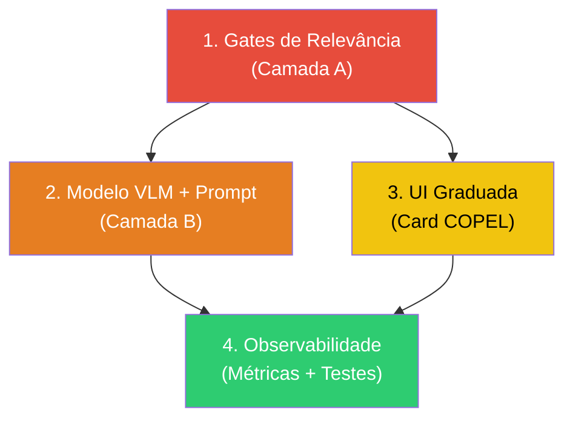

# RELATÓRIO ARQUITETURAL — Gates de Relevância, VLM e Narrativa

**Projeto**: Monitor Ipiranga (`servicos-status`)
**Data**: 2026-08-12
**Autoria**: Auditoria arquitetural automatizada (Opus)
**Escopo**: Diagnóstico de falsos alarmes e contradições internas observadas em produção; proposta de correção estrutural (sem implementação de código).

---

## Sumário Executivo

O painel público exibiu simultaneamente (2026-08-12 ~06:03 BRT) um **alerta de tempestade COPEL** e um **boletim VLM descrevendo núcleo "se aproximando de Ipiranga"**, enquanto o mapa de radar mostrava **zero chuva no Paraná** — os únicos núcleos detectados estavam a 336 km (divisa PR/SP) e 589 km (RS). O cidadão vê um "Alerta de Tempestade" presente quando a chuva mais próxima está a 8 horas de distância e a previsão numérica marca 16% de probabilidade.

**Causa raiz**: a Camada A (determinística) detecta corretamente os núcleos, mas **não aplica nenhum gate de distância, ETA mínima ou relevância local** antes de acender o alerta. A Camada B (narrativa VLM) recebe dados descontextualizados e — embora fiel à imagem — produz texto alarmista sem proporcionalidade. A UI apresenta o alerta como binário, sem horizonte temporal nem graduação de severidade.

---

## 1. Camada A — Gates de Distância, ETA e Relevância

### 1.1 Diagnóstico: `currentDominant` sem filtro geográfico

**Evidência**: [`src/index.ts:385-424`](file:///root/servicos-status/src/index.ts#L385-L424)

```
if (nowcast.currentDominant === "none" || nowcast.frames.length === 0) {
    state.hasRegionalRain = false;
    ...
} else {
    state.hasRegionalRain = true;
    ...
}
```

O gate é **puramente de intensidade**: qualquer `currentDominant != "none"` acende `hasRegionalRain = true`, **independentemente da distância ao alvo**. No caso real, `currentDominant = "extreme"` refere-se a um núcleo de 58 dBZ a **589 km** (RS) — irrelevante para Ipiranga.

**Origem do `currentDominant`**: [`src/radar-analysis.ts:735-738`](file:///root/servicos-status/src/radar-analysis.ts#L735-L738) — pega a intensidade do primeiro núcleo não-leve (`cells[0]`), que é o mais intenso **do frame todo**, sem filtro de posição.

### 1.2 Diagnóstico: `assessAllThreats` sem gate de distância/ETA

**Evidência**: [`src/radar-analysis.ts:628-659`](file:///root/servicos-status/src/radar-analysis.ts#L628-L659)

```
.filter((c) => c.intensity === "heavy" || c.intensity === "extreme")
```

O filtro é apenas por intensidade. Núcleos a 336 km com ETA de 488 min (~8 horas) e a 589 km são incluídos como threats. A ordenação por ETA é correta (aproximando primeiro), mas **não há corte**: threats a 8h de distância são tratados com a mesma urgência que um a 30 min.

### 1.3 Diagnóstico: `threats[0]` promovido a "núcleo mais ameaçador" sem limiar

**Evidência**: [`src/index.ts:397-414`](file:///root/servicos-status/src/index.ts#L397-L414)

O texto do `regionalRainAlert` é construído a partir de `threats[0]`, que no caso real tem ETA de 488 min. O texto resultante — *"Núcleo forte a ~336 km de Ipiranga, aproximando-se (ETA ~488 min)"* — é apresentado dentro de um card rotulado "⚠️ Alerta de Tempestade", sem qualquer indicação de que isso está a 8 horas de distância.

### 1.4 Proposta Arquitetural: Sistema de Relevância em 3 Zonas

Introduzir um **sistema de zonas de relevância** com raios configuráveis:

| Zona | Raio | ETA máximo | Efeito |
|------|------|------------|--------|
| **Iminente** | 0–80 km | ≤ 120 min | Card COPEL ativo ("Alerta"), boletim com urgência |
| **Vigilância** | 80–200 km | 120–360 min | Card COPEL em modo "Vigilância" (cor diferente), boletim informativo |
| **Monitoramento** | 200–600 km | > 360 min | Card COPEL **desligado**, dado disponível apenas no JSON/API |

**Onde aplicar**:

**(a) `assessAllThreats`** ([`radar-analysis.ts:628`](file:///root/servicos-status/src/radar-analysis.ts#L628)): Adicionar campo `relevanceZone` ao `ThreatCell` com base na distância e ETA calculados. Não descartar threats distantes (manter para observabilidade), mas marcá-los.

**(b) `syncWeatherCycle`** ([`index.ts:385-424`](file:///root/servicos-status/src/index.ts#L385-L424)): Substituir a lógica binária `currentDominant != "none" → alerta` por:
- Filtrar threats pela zona "Iminente" antes de acender `hasRegionalRain = true`
- Calcular `currentDominant` apenas sobre núcleos dentro do raio de relevância (ex.: 200 km), não do frame inteiro
- Adicionar novo campo `alertLevel: "alert" | "watch" | "monitor" | "none"` ao `WeatherState`

**(c) Novo campo `relevantDominant`** derivado dos threats filtrados por zona, separado do `currentDominant` (que permanece para observabilidade/debug).

### 1.5 Proposta Complementar: Gate de ETA mínima para "alerta ativo"

Mesmo dentro da zona Iminente (≤80 km), um núcleo **estacionário** (velocidade < 2 km/h) ou **afastando-se** (`receding`) não deve gerar alerta. Proposta:

- `approaching` + ETA ≤ 120 min → Alerta
- `approaching` + ETA 120-360 min → Vigilância
- `crossing` ou `receding` → Monitoramento (independente da distância)
- Velocidade < 2 km/h → Monitoramento (célula estacionária = incerteza alta)

### 1.6 Riscos e Efeitos Colaterais

- **Risco de falso negativo**: célula que surge a 50 km e se intensifica rapidamente pode não ser detectada se o frame anterior não a tinha. **Mitigação**: manter um gate de distância _pura_ como fallback — qualquer núcleo extreme a < 50 km acende alerta independente de ETA.
- **Dependência**: nenhuma. Esta correção é autônoma e pode ser feita antes das demais.
- **Prioridade**: 🔴 **CRÍTICA** — é a raiz de 100% dos falsos alarmes observados.

---

## 2. Camada B — Modelo VLM, Prompt e Validação

### 2.1 Diagnóstico: Modelo Llama 3.2 Vision (NIM) inadequado

**Evidência**: [`src/nowcast-vlm.ts:261-264`](file:///root/servicos-status/src/nowcast-vlm.ts#L261-L264)

```
const visionModels = [
    "meta/llama-3.2-90b-vision-instruct",
    "meta/llama-3.2-11b-vision-instruct",
];
```

O Llama 3.2 Vision no tier gratuito da NVIDIA NIM apresenta:
- **Timeouts frequentes** no 90B (mencionado no comentário L258-260), forçando fallback para o 11B
- O 11B tem **capacidade limitada de seguir instruções complexas** (8 regras no prompt, conciliação de fontes, proibições de contradição)
- O VLM **não está alucinando a imagem** (o briefing confirma: "cores azuis e amarelas" bate com heavy/38 dBZ), mas **falha na contextualização**: narra "núcleo se aproximando" sem mencionar que está a 336 km/8h
- A narrativa do VLM é **fiel aos dados que recebe**, mas os dados chegam **sem contexto de relevância** (ver Seção 1)

### 2.2 Proposta: Migração para Gemma 4 via Gemini API

**Evidência de viabilidade**: O config já possui `geminiApiKey` / `GEMINI_API_KEY` ([`src/config.ts`](file:///root/servicos-status/src/config.ts)), indicando infraestrutura pronta.

**Arquitetura proposta**:

**(a) Provider**: Gemini API (nativa Google) com modelo `gemma-4` ou `gemini-2.5-flash` (vision). Vantagens:
- Melhor aderência a instruções complexas em pt-BR
- Latência previsível (não depende de fila NIM free-tier)
- Custo controlável (flash = baixo custo; entrada/saída pequenas)
- Compatível com serverless Vercel (HTTP request simples, sem SDK pesado)

**(b) Fallback chain**: Gemma 4 (primário) → Gemini Flash (secundário) → Heurística (fallback determinístico). Manter a estrutura de loop sobre `visionModels` já existente ([`nowcast-vlm.ts:266-332`](file:///root/servicos-status/src/nowcast-vlm.ts#L266-L332)), apenas trocando o array de modelos e o endpoint.

**(c) Avaliação de custo**: O boletim é gerado a cada 15 min (`NOWCAST_BULLETIN_TTL_MS`), com cache persistido ([`index.ts:437-468`](file:///root/servicos-status/src/index.ts#L437-L468)). São ~96 chamadas/dia. Com imagem de ~50 KB (composite 512px) e resposta de ~300 tokens, o custo estimado é desprezível no tier pago do Gemini (< US$ 0.50/dia).

### 2.3 Proposta: Arquitetura de Prompt em Dois Estágios

O prompt atual ([`nowcast-vlm.ts:236-256`](file:///root/servicos-status/src/nowcast-vlm.ts#L236-L256)) mistura **descrição visual** com **redação narrativa** em uma única chamada. Isso sobrecarrega o modelo e aumenta a chance de alucinação contextual.

**Proposta — Pipeline de dois estágios**:

**Estágio 1 — Descrição Cega (Visual-Only)**:
- Enviar APENAS a imagem do composite com prompt mínimo: *"Descreva objetivamente as cores e posições dos núcleos visíveis nesta imagem de radar meteorológico (paleta Universal Blue). Não interprete significado meteorológico."*
- Saída: descrição factual das cores/posições (ex.: "mancha amarela no quadrante inferior esquerdo do frame 3")
- **Propósito**: isolar a capacidade visual do modelo, sem contaminação por dados numéricos

**Estágio 2 — Redação Ancorada (Text-Only)**:
- Enviar ao modelo (pode ser text-only, mais barato): a descrição do Estágio 1 + todos os dados da Camada A (município, distância, ETA, veredito, ECMWF) + instruções de redação
- **Propósito**: o modelo redige a partir de dados estruturados, não interpreta imagem — elimina a classe inteira de "alucinação visual contextual"

**Vantagem**: se a descrição visual do Estágio 1 contradiz os dados da Camada A (ex.: "mancha amarela sobre Ipiranga" quando o núcleo mais próximo está a 336 km), a contradição é **detectável programaticamente** antes do Estágio 2.

### 2.4 Proposta: Injeção de Contexto de Relevância no Prompt

Independente da troca de modelo, o prompt atual **não informa ao VLM a relevância do núcleo para o cidadão**. Proposta de adição ao bloco de dados:

- **Distância em linguagem humana**: "Este núcleo está a 336 km de Ipiranga — equivalente à distância de Curitiba a Londrina. Levaria ~8 horas para chegar se mantivesse curso e intensidade."
- **Nível de alerta da Camada A**: "O sistema determinístico classifica este cenário como MONITORAMENTO (sem alerta iminente)."
- **Instrução explícita de proporcionalidade**: "Se o nível for MONITORAMENTO, o tom deve ser tranquilizador. Se for VIGILÂNCIA, informativo. Somente se for ALERTA, usar tom de urgência."

### 2.5 Proposta: Quarentena de Saída (Output Guardrails)

A validação atual ([`nowcast-vlm.ts:362-457`](file:///root/servicos-status/src/nowcast-vlm.ts#L362-L457)) é sólida para contradição de veredito e regurgitação de prompt, mas **não verifica proporcionalidade**. Propostas de extensão:

**(a) Gate de alarmismo desproporcional**: Se o nível de alerta da Camada A é "monitoramento" mas o texto contém palavras de urgência ("alerta", "tempestade", "atenção imediata", "risco"), rejeitar.

**(b) Gate de distância omitida**: Se a distância do núcleo é > 100 km e o texto não menciona a distância (ausência de padrão `\d+ km`), rejeitar — o cidadão precisa saber que o núcleo está longe.

**(c) Gate de ETA inverossímil na narrativa**: A validação de ETA existe ([`nowcast-vlm.ts:413-447`](file:///root/servicos-status/src/nowcast-vlm.ts#L413-L447)) mas com tolerância de 35%. Para ETAs > 360 min, o texto não deveria mencionar ETA em minutos (confuso) — converter para horas ou simplesmente dizer "muitas horas".

### 2.6 Riscos e Efeitos Colaterais

- **Risco de rejeição excessiva**: Gates muito agressivos podem levar a fallback heurístico frequente. **Mitigação**: a heurística ([`nowcast-vlm.ts:460-494`](file:///root/servicos-status/src/nowcast-vlm.ts#L460-L494)) é confiável e determinística — um fallback frequente é preferível a um texto alarmista.
- **Risco de latência no dois estágios**: duas chamadas ao VLM duplicam a latência. **Mitigação**: o cache de 15 min (`NOWCAST_BULLETIN_TTL_MS`) absorve isso; o cidadão não espera em tempo real.
- **Dependência**: a Seção 1 (gates de relevância) deve ser implementada **antes** desta, pois os dados de relevância alimentam o prompt.
- **Prioridade**: 🟠 **ALTA** — amplifica o problema da Seção 1, mas não é a causa raiz.

---

## 3. UI e Copy — Card COPEL, Rótulos e Graduação

### 3.1 Diagnóstico: Card COPEL é binário e sem horizonte

**Evidência**: [`src/public/index.html` (~L1163-1180)](file:///root/servicos-status/src/public/index.html) — O card lê `window.latestWeatherData.hasRegionalRain` (booleano) e exibe:
- `true` → "⚠️ Alerta de Tempestade: Risco de Oscilação / Queda de Energia (COPEL)"
- `false` → card oculto

Não há:
- Indicação de **horizonte temporal** ("nas próximas X horas")
- **Graduação de severidade** (alerta vs. vigilância vs. monitoramento)
- **Distância do núcleo** (o cidadão não sabe se está a 5 km ou 500 km)

### 3.2 Proposta: Card Graduado com Horizonte Temporal

Substituir o booleano `hasRegionalRain` na UI por um campo estruturado `alertLevel`:

| `alertLevel` | Cor do card | Ícone | Texto |
|---|---|---|---|
| `"alert"` | Vermelho / Laranja | ⚠️ | "Alerta: Núcleo de chuva [intensidade] a X km, chegando em ~Y min" |
| `"watch"` | Amarelo | 👁️ | "Vigilância: Núcleo de chuva [intensidade] detectado a X km (ETA ~Y h). Acompanhe." |
| `"monitor"` | Cinza claro | ℹ️ | "Monitoramento: Atividade de radar detectada a X km, sem risco iminente para Ipiranga." |
| `"none"` | *(oculto)* | — | — |

### 3.3 Proposta: Texto do `regionalRainAlert` com proporção

O texto atual ([`index.ts:423`](file:///root/servicos-status/src/index.ts#L423)) mistura emoji de tempestade 🌩️ com "Atenção a oscilações na rede elétrica (COPEL)" para qualquer núcleo detectado, mesmo a 589 km. Proposta:

- **Remover** a menção à COPEL de cenários de monitoramento (sem risco real de oscilação)
- **Incluir** a distância e o ETA em linguagem humana: "Núcleo de chuva forte detectado a 336 km de Ipiranga (divisa PR/SP). Se mantiver curso, chegaria em aproximadamente 8 horas — sem risco iminente."
- **Reservar** o emoji ⚠️ e a menção à COPEL para alertLevel `"alert"` (zona Iminente)

### 3.4 Diagnóstico: Boletim VLM exibido sem contexto de confiança

O boletim gerado pelo VLM é apresentado como "Boletim IA" sem indicação de:
- **Fonte** (VLM vs. heurística)
- **Idade do dado** (pode ter até 15 min de cache + atraso do frame)
- **Nível de confiança** da análise

### 3.5 Proposta: Metadata de Confiança no Boletim

Adicionar ao `NowcastBulletin` ([`nowcast-vlm.ts:45-49`](file:///root/servicos-status/src/nowcast-vlm.ts#L45-L49)):
- `confidence: "high" | "medium" | "low"` — baseado em: número de frames analisados, se o movimento foi detectável, se ECMWF e radar convergem
- `dataAge: string` — "Análise baseada em dados de radar de X minutos atrás"
- `source` já existe, mas não é exibido na UI — exibi-lo como "(gerado por IA)" vs. "(análise automática)"

### 3.6 Riscos e Efeitos Colaterais

- **Risco de complexidade visual**: card com muitos estados pode confundir. **Mitigação**: 3 estados + oculto é gerenciável; usar cores e ícones consistentes com padrões meteorológicos (verde/amarelo/vermelho).
- **Dependência**: requer o `alertLevel` da Seção 1.
- **Prioridade**: 🟡 **MÉDIA** — a correção da Seção 1 resolve o falso positivo mesmo sem mudanças na UI, mas a graduação melhora drasticamente a experiência do cidadão.

---

## 4. Observabilidade e Prevenção de Regressão

### 4.1 Diagnóstico: Ausência de métricas de falso alarme

O sistema registra logs (`logger.info`/`logger.warn`) mas não há:
- **Contagem de alertas emitidos** por zona de relevância
- **Taxa de rejeição** de boletins VLM pela validação
- **Registro histórico** do `alertLevel` emitido vs. chuva real observada (verificação a posteriori)

### 4.2 Proposta: Métricas Estruturadas

**(a) Log enriquecido no `syncWeatherCycle`** ([`index.ts:426-431`](file:///root/servicos-status/src/index.ts#L426-L431)):
- Adicionar: `alertLevel`, `nearestThreatKm`, `nearestThreatEtaMin`, `threatsInZoneAlert`, `threatsInZoneWatch`, `threatsInZoneMonitor`
- Formato JSON estruturado para ingestão por ferramentas de observabilidade (Vercel Logs, Axiom, etc.)

**(b) Endpoint `/api/diagnostics`** (protegido):
- Últimos N ciclos com: `alertLevel` emitido, threats detectados (com distância/ETA), boletim (fonte + texto), ECMWF, frames analisados
- Permite reproduzir o estado exato que gerou um alerta contestado

**(c) "Verificação fantasma" (shadow verification)**:
- A cada ciclo, registrar se a chuva prevista no ciclo anterior **realmente ocorreu** (comparar nowcast t-15min com frame atual)
- Acumular taxa de acerto/falso alarme por zona → ajustar raios das zonas com dados reais

### 4.3 Proposta: Teste de Regressão Determinístico

Cenários de teste baseados no incidente real:

| Cenário | Entrada | Saída esperada |
|---|---|---|
| Núcleo extreme a 589 km, estacionário | `distToTargetKm=589, speedKmh=0` | `alertLevel="none"` |
| Núcleo heavy a 336 km, approaching, ETA 488 min | `distToTargetKm=336, etaMin=488` | `alertLevel="monitor"` (fora da zona de vigilância) |
| Núcleo heavy a 60 km, approaching, ETA 45 min | `distToTargetKm=60, etaMin=45` | `alertLevel="alert"` |
| Núcleo extreme a 30 km, receding | `distToTargetKm=30, approach="receding"` | `alertLevel="monitor"` (afastando-se) |
| Sem núcleos | `frames=[], cells=[]` | `alertLevel="none"`, `hasRegionalRain=false` |
| Boletim VLM diz "aproximando" quando veredito é "receding" | Texto com "aproximando" + verdict.approach="receding" | `validateBulletinAgainstVerdict → false` |

### 4.4 Proposta: Dashboard Interno de Decisão (Não-público)

Um painel simples (rota `/admin/decisions`) que mostre, para cada ciclo:
- Mapa com os núcleos detectados e as 3 zonas concêntricas
- Veredito de cada threat com seta de direção
- Decisão final (`alertLevel`) com justificativa
- Boletim gerado (VLM ou heurística) com flag de validação

**Propósito**: quando um cidadão questionar o alerta, o operador pode verificar imediatamente por que o sistema decidiu assim (ou não).

### 4.5 Riscos e Efeitos Colaterais

- **Risco de overhead**: logs estruturados e verificação fantasma consomem recursos. **Mitigação**: são operações locais e leves; o ciclo já roda a cada 15 min.
- **Dependência**: a Seção 1 (zonas) deve estar implementada para as métricas por zona fazerem sentido.
- **Prioridade**: 🟢 **DESEJÁVEL** — não resolve o falso alarme imediato, mas previne regressões futuras.

---

## 5. Mapa de Dependências e Ordem de Implementação



| Fase | Seção | Prioridade | Estimativa | Dependências |
|------|-------|------------|------------|--------------|
| **1** | Gates de Relevância (Camada A) | 🔴 Crítica | 1-2 dias | Nenhuma |
| **2** | Modelo VLM + Prompt (Camada B) | 🟠 Alta | 2-3 dias | Fase 1 |
| **3** | UI Graduada (Card COPEL) | 🟡 Média | 1 dia | Fase 1 |
| **4** | Observabilidade + Testes | 🟢 Desejável | 1-2 dias | Fases 1-3 |

---

## 6. Resumo das Contradições Observadas e Suas Raízes

| Contradição observada | Causa raiz | Seção de correção |
|---|---|---|
| Card "Alerta de Tempestade" com zero chuva em 250 km | `currentDominant` sem filtro de distância | §1.1 |
| Boletim VLM: "núcleo se aproximando" (a 336 km, ETA 8h) | Prompt sem contexto de relevância; threats sem gate | §1.2, §2.4 |
| Boletim VLM: "previsão numérica 0%" vs. estado 16% | Possível staleness ou arredondamento no ECMWF; VLM narrou dado antigo do cache de 10 min | §2.5(c) |
| ETA de 488 min apresentado como "alerta presente" | Ausência de horizonte temporal no card e no alert text | §3.2, §3.3 |
| Texto "⚠️ Alerta de Tempestade" + mapa limpo | Card binário sem graduação de severidade | §3.1, §3.2 |

---

## 7. Ideias Exploratórias (Fora do Escopo Imediato)

### 7.1 Ancoragem Geográfica por Construção de Prompt

Em vez de dizer ao VLM "o núcleo está em [município]", construir o prompt de modo que **o município seja a única informação geográfica disponível** — remover lat/lon crus do prompt para que o modelo não possa "inventar" localizações alternativas. O município vem da malha IBGE (point-in-polygon, [`getMunicipioComFallback`](file:///root/servicos-status/src/nowcast-vlm.ts#L163-L167)) e é a fonte oficial.

### 7.2 Pré-classificação de Frame por Heurística

Antes de chamar o VLM, verificar programaticamente se o composite tem pixels significativos na **região de interesse** (quadrante correspondente a Ipiranga ± 80 km). Se não houver, não chamar o VLM — usar a heurística diretamente e dizer "radar limpo na região imediata de Ipiranga". Economiza cota de API e evita que o VLM narre núcleos distantes como se fossem relevantes.

### 7.3 Score de Convergência Radar × ECMWF

Criar um score numérico (0-100) que combine:
- Presença de núcleo na zona iminente (radar)
- Probabilidade de chuva (ECMWF)
- Intensidade do núcleo mais próximo
- Tendência (se o núcleo está se intensificando ou dissipando entre frames)

Score alto + radar limpo = "chuva possível nas próximas horas, acompanhe". Score baixo + radar ativo longe = "sem risco iminente". Score alto + radar ativo perto = alerta completo. Esse score pode alimentar tanto o card quanto o prompt do VLM.

### 7.4 Histórico de Dissipação

Núcleos com ETA > 3 horas têm alta probabilidade de dissipar antes de chegar. Estudar os dados históricos de frames para calcular uma **taxa de dissipação média** por faixa de intensidade e incorporar no cálculo de relevância (ex.: núcleo heavy a 300 km com taxa histórica de 60% de dissipação em 5h → probabilidade efetiva de impacto < 40%).

---

> **Nota final**: O sistema já possui fundações sólidas — a Camada A (detecção, segmentação, tracking) funciona corretamente, e a arquitetura de validação pós-geração ([`validateBulletinAgainstVerdict`](file:///root/servicos-status/src/nowcast-vlm.ts#L362-L457)) demonstra maturidade de design. As falhas observadas são de **gates ausentes** (não de lógica quebrada) e de **escolha de modelo** (não de arquitetura). As correções propostas são incrementais e retrocompatíveis.
